## JACK Financial's Portffolio Suitability Application

One of the most powerful psychological pulls is the urge to reciprocate.  When a person receives a gift, even when it is unrequested or of limited value, the person feels a strong urge to return the favor.  Building on this idea, this Portfolio Suitability Application allows a user to answer a series of questions.  These questions create a customized portfolio plan, composed of multiple ETFs, based upon the potential client's risk tolerance and investing horizon.  Additionally, this report contains graphs and charts that can be the springboard to a demonstration of expertise by the financial advisor.  Most importantly, the application is simple to use.

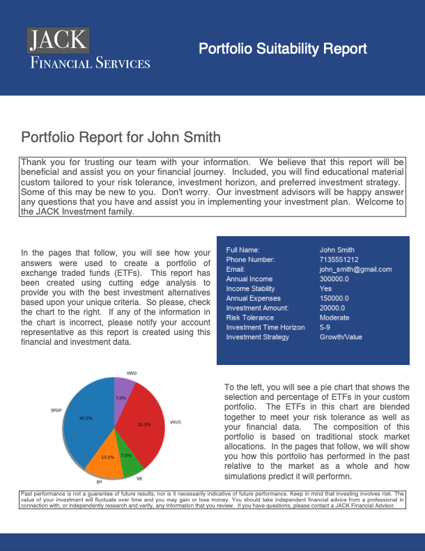

---

## Technologies

The requirements for running this CLI application are found in the root directory in the file requirements.txt.  These requirements can be installed using the following command.

`pip install -r requirements.txt`

The install will verify that the following are installed in the necessary directory to run the application:

- alpaca_trade_api==1.4.3
- fire==0.4.0
- fpdf==1.7.2
- matplotlib==3.4.3
- numpy==1.20.3
- pandas==1.3.4
- Pillow==9.0.1
- python-dotenv==0.19.2
- python_dateutil==2.8.2
- pytz==2021.3
- questionary==1.10.0

In addition to these libraries, you will need to have a .env file containing your alpaca key and your alpaca secret key.  An explanation for creating an installing a .env file is beyond the scope of this README file, but help can be found [here](https://www.youtube.com/watch?v=7LFLV8VsN9o).  You can obtain your alpaca keys [here](https://alpaca.markets).

## CLI Application Launch and Use

Once the above are installed and your .env file is created that contains your alpaca keys, navigate to the directory containing the app.py file and enter the following:

`python app.py`

Once you have launched the application, you will be welcomed with the following message:

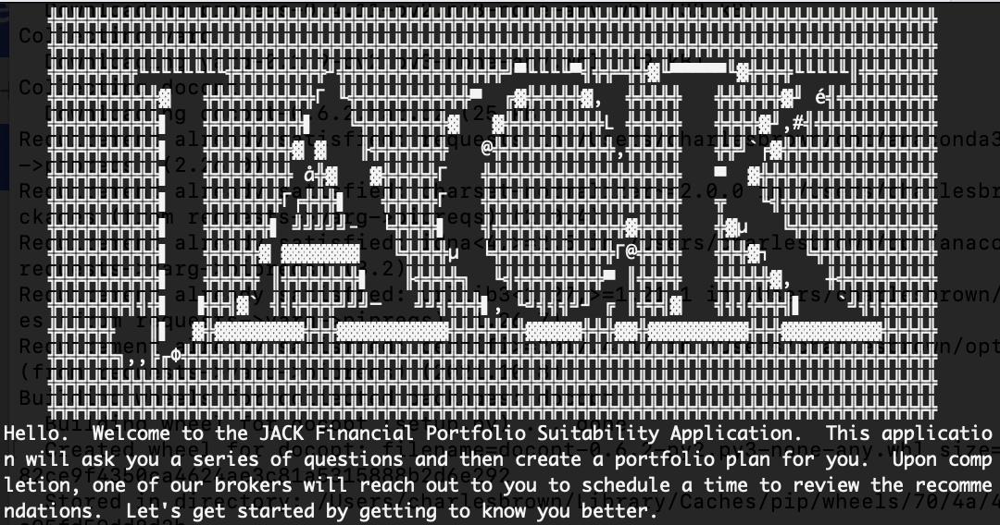

---

After launch, the user will be asked a series of questions about their personal information, their financial information, and their investing experience and preferences.  

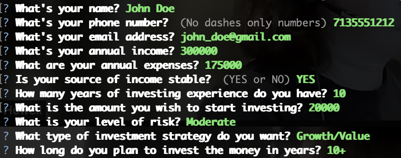

This data is in the Risk Score algorythm to determine the appropriate risk profile for the client.  This algorythm is located in /data/investment_scores.py.  

From the risk profile, a portfolio is created based upon the tradition allocation model published by RBC.

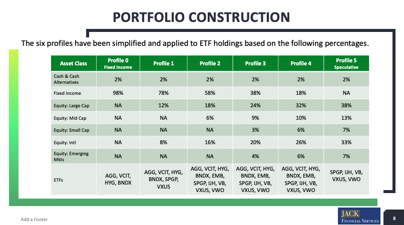

The selected portfolio is then shown to the client through a variety of charts, graphs, and tables.
### Portfolio distribution pie chart
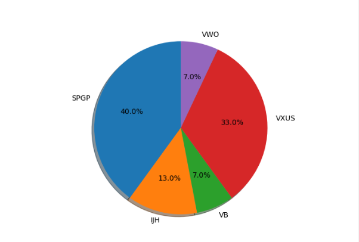
### Cumulative Return Client v. S&P
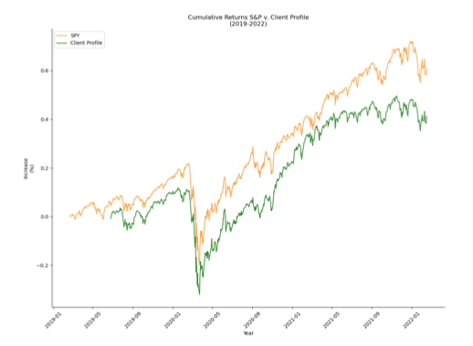
### Client Volitility Comparison with Benchmarks
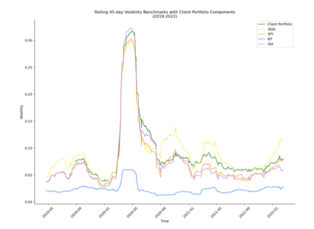
### Client Composite Volitilty
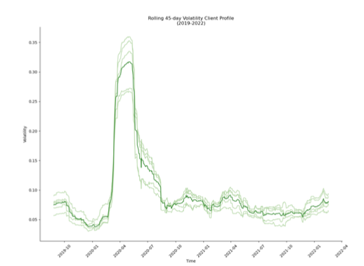
### Monte Carlo Comparison Table
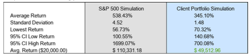

Each of the above images are saved for use in /img/.

## Output

The above are contained in a PDF that is saved in /pdf/.

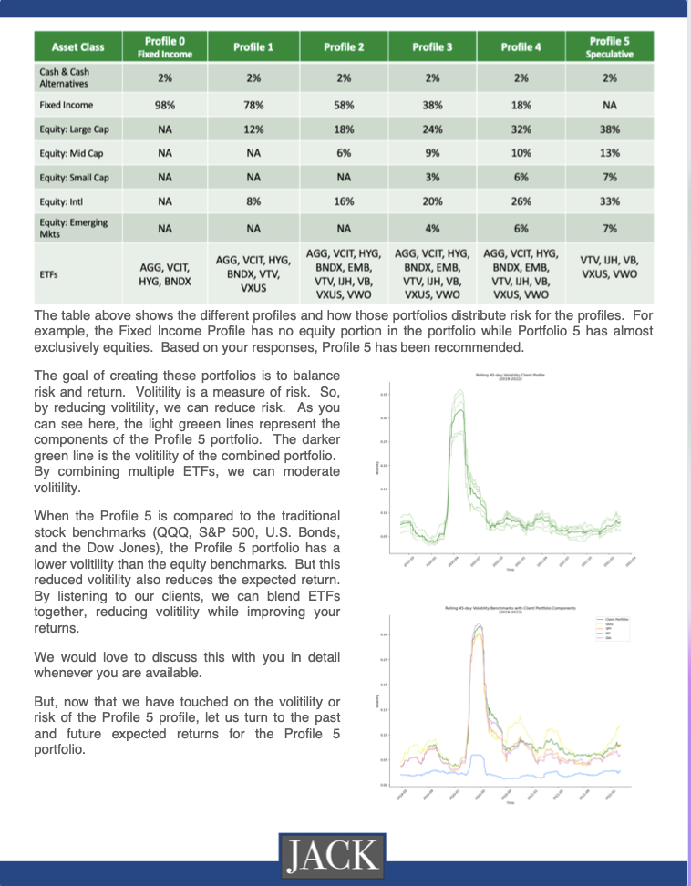
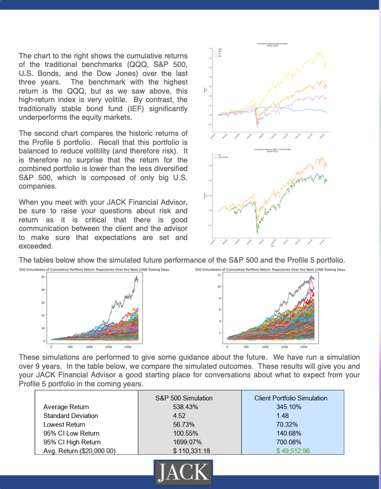

## Directories

- admin/ - Contains the PowerPoint presentation
- data/ - Contains etf_data.py, investment_scores.py, MCForecastTools.py
- img/ - Stores image files for use by README and PDF
- pdf/ - Contains the PDF output
- ui/ - Contains client_output.py, client_questions.py, vis.py

## Functions

### ui.client_questions:
- import basic_info
- investment_info
- financial_info
### data.investment_scores:
- get_client_portfolio
- score_calculator
- get_MC_length
### data.etf_data:
- get_benchmark_data
- get_tickers
- get_client_portfolio_data
- get_client_data
- get_MC_list_benchmark
- get_MC_list_client
- get_daily_returns
- get_cumulative_returns
- get_closing_prices_benchmark
### ui.vis
- save_vis_cumulative_return_distribution_benchmark
- save_45_day_rolling_volitility_benchmark
- save_vis_cumulative_return_distribution_client
- save_45_day_rolling_volitility_client
- save_vis_cumulative_return_benchmark_client
- plot_mc_sp, plot_mc_client
- pie_chart_client_portfolio   
### ui.client_output
- clear_console
- intro_message
- create_info_img
- exit_message
- create_pdf
- create_MC_comparison_img     

---

## Contributors

This project was created as a part of the Rice FinTech Bootcamp by Charles Brown, Jacob Burnett, Kevin Gross, Ann Howell.

---

## License

This software is licensed for use under the included MIT License.
